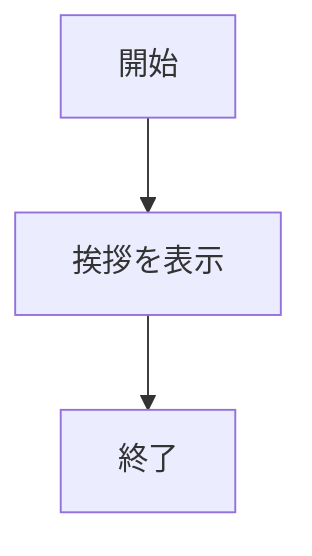
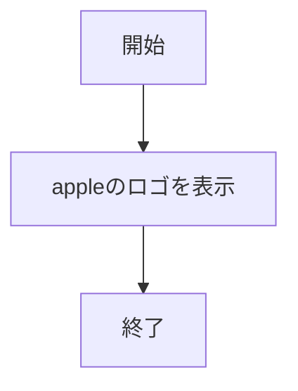
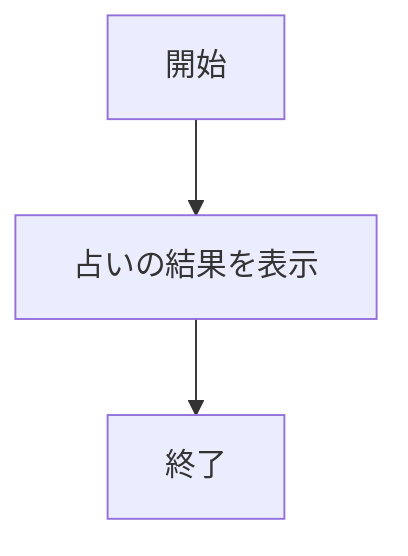
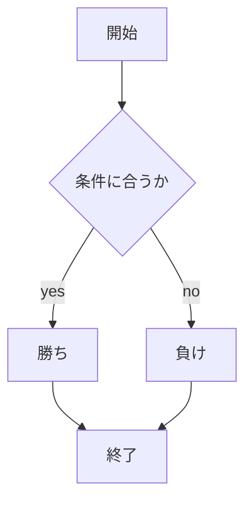
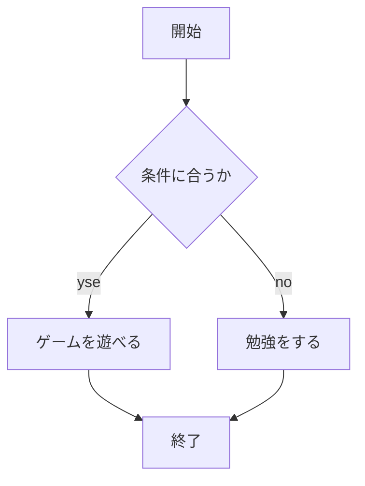
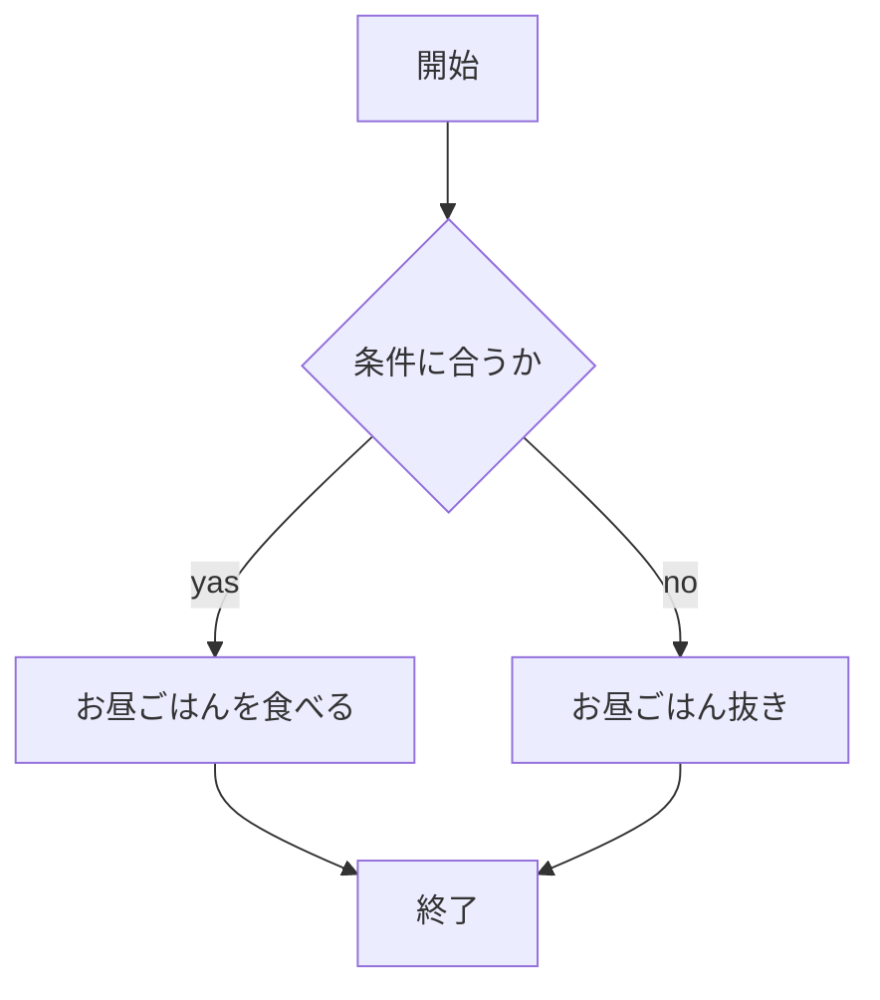

# webpro_06

## このプログラムについて

## ファイル一覧

ファイル名|説明
-|-
app5.js|プログラム本体
public/janken.html|じゃんけんの開始画面
public/game.html|遊びたいゲームの選択画面
public/lunch.html|今日の昼ご飯の選択画面
views/janken.ejs|じゃんけんのテンプレートファイル名
views/game.ejs|ゲーム選択のテンプレートファイル名
views/lunch.ejs|昼ご飯選択のテンプレートファイル名

app5.jsで使用できるWebサーバー|説明
-|-
hello1|挨拶が表示される
hello2|挨拶が表示される
icon|appleのロゴが表示される
luck|占いが実行される
janken|じゃんけんをする
game|ゲームを選べる
lunch|昼ご飯を選べる
## 起動方法
1. ```node app5.js```を起動する．
1. 任意のWebブラウザににアクセスする．今回は```localhost:8080/```以降に```hello1```,```hello2```,```icon```,```luck```,```public/janken.html```,```public/game.html```,```public/lunch.html```のいずれかを入力することで7つのWebサーバーから任意のWebサーバーを開くことができる．
## 編集したファイルをGitで管理する方法
1. ```ターミナル```を起動する．
1. 適切なディレクトリに移動し，```git add .```と入力する．
1. ```git commit -am 'コメント'```と入力する(コメントには変更理由や変更内容を記述する)．
1. ```git push```と入力して終了．
## 仕様項目(hello1)
#### 機能の説明
挨拶として，挨拶1ではHello world，挨拶2ではBon jourと表示される．
それぞれ変数に文字を格納している．
####　使用手順
1. Webブラウザにアクセスする．

## 仕様項目(hello２)
#### 機能の説明
hello1と同様に挨拶として，挨拶1ではHello world，挨拶2ではBon jourと表示される．
hello1と異なり変数を定義しておらず，直接文字を表示している．
####　使用手順
1. Webブラウザにアクセスする．

## 仕様項目(アイコン)
#### 機能の説明
Apple_logo_black.svgを表示する．
####　使用手順
1. Webブラウザにアクセスする．

## 仕様項目(占い)
#### 機能の説明
Webサーバーにアクセスするたびに占いの結果が表示される．
####　使用手順
1. Webブラウザにアクセスする．

## 仕様項目(じゃんけん)
#### 機能の説明
自分の```手(グー，チョキ，パー)```を入力すると，コンピューター側がランダムで手を出す．自分の手とコンピューター側の手に応じて勝敗が決まる．じゃんけんの試合数と勝利数が結果によってカウントされる．

####　使用手順
1. Webブラウザにアクセスする．
1. 自分の```手```を入力する．
1. ```送信```を押す．

以下はドキュメントである．

## 仕様項目(ゲーム)
#### 機能の説明　
自分の```遊びたいゲーム(モンハン，マイクラ，APEX)```を入力すると，コンピューター側がランダムでゲームを提示する．自分の選択したゲームとコンピューター側が選択したゲームが一致すればゲームをすることができる．結果に応じて何回遊ぶことができたかの結果がカウントされる．
####　使用手順
1. Webブラウザにアクセスする．
1. 自分の```遊びたいゲーム```を選択する．
1. ```送信```を押す．

以下はドキュメントである．

## 仕様項目(昼ご飯)
#### 機能の説明　
自分の今日の食べたい```お昼ごはんのおかずの系統(肉系，魚系)```を入力すると，コンピューター側がランダムで今日のお昼ごはんのおかずを提示する．自分の選択した系統とコンピューター側が選択した系統が一致すれお昼ごはんを食べることができる．結果に応じて何回お昼ごはんを食べることができたかの結果がカウントされる．
####　使用手順
1. Webブラウザにアクセスする．
1. 自分の```遊びたいゲーム```を選択する．
1. ```送信```を押す．

以下はドキュメントである．
