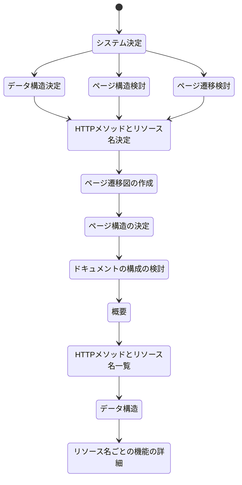

```mermaid
stateDiagram-v2
    [*] --> システム決定
    システム決定 --> データ構造決定
    システム決定 --> ページ構造検討
    システム決定 --> ページ遷移検討
    データ構造決定 --> HTTPメソッドとリソース名決定
    ページ構造検討 --> HTTPメソッドとリソース名決定
    ページ遷移検討 --> HTTPメソッドとリソース名決定
    HTTPメソッドとリソース名決定 --> ページ遷移図の作成
    ページ遷移図の作成 --> ページ構造の決定
    ページ構造の決定 --> ドキュメントの構成の検討
    ドキュメントの構成の検討 --> 概要
    概要 --> HTTPメソッドとリソース名一覧
    HTTPメソッドとリソース名一覧 --> データ構造
    データ構造 --> リソース名ごとの機能の詳細
```